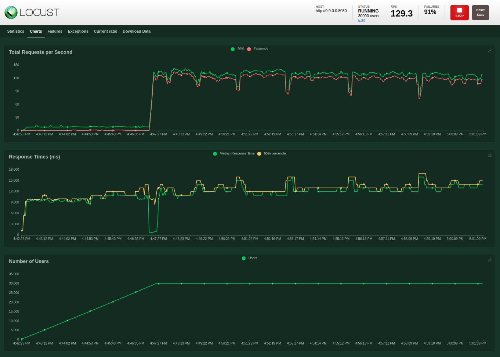

# lmwn-recommendation-system

## Prerequisuites
- Python3 installation
- Docker installation

<br/><br/>

## Getting Start

create a virtual environment

```
python3 -m venv .venv
```


install libraries

```
pip3 install -r requirements.txt
```

<br/><br/>

## Model Training
directory structure

```
└── lmwn-recommendation-system
    ├── model.py                                    # model training code
    ├── training_data.csv                           # in this case 'transaction'
    └── models                                      # models output dir
        └── model_{date}_{time}                     # model version dir
            ├── model_{date}_{time}.pickle          # model weight
            └── model_{date}_{time}_params.json     # model parameters
```
<br/>
train model

```
python3 model.py
```
**note** if you execute this way, your training data must be in the same directory with *model.py* and the output will follow the above directory structure

<br/>

you can run with your custom configuration
```
python3 model.py \              
-data /home/user/data.csv \
-params /home/user/lmwn-recommendation-system/models/model_20220820_221401/model_20220820_221401_params.json \
-dir /home/user/Desktop/weight \
-model save_weight.pickle
```

for more details, run

```
python3 model.py -h
```

<br/><br/>

## Deploy Model
directory structure

```
└── lmwn-recommendation-system
    └── Dockerfile                          # deploy on docker code
    ├── backend                             # server directory
        ├── main.py                         # code to start server
        └── app                             # api directory
            ├── data                        # data, used to get ids
            ├── main.py                     # FastAPI app
            ├── models                      # model directory
                └── input_model.pickle      # model to be deployed
            └── services                    # other code
                └── data_services.py        # code for data handling
                └── ml_services.py          # code for ml operations
```

<br/>

### Select Model
copy your trained model and replace *input_model.pickle* according to the directory structure above

<br/>

### Run on localhost

```
cd backend
python3 main.py
```

<br/>

### Run with docker
build docker image
```
cd lmwn-recommendation-system
docker build -t <your-image-name> .
```
run docker in background
```
docker run -p 8080:8080 <your-image-name>
```

or

run interactive docker
```
docker run -it -p 8080:8080 <your-image-name>
```

<br/>

### Call API
URL template : *localhost:8080/recommend?uid={user_id}*

example : [localhost:8080/recommend?uid=FAKE_USER_ID](localhost:8080/recommend?uid=FAKE_USER_ID)

more info : [swagger](localhost:8080/docs)

**note** for user_id that is not exist in the given transaction data, I assume that this user_id is the new user, therefore the system will recommend top 10 hot restaurants instead of user preference. 

<br/><br/>

## Loadtest
directory structure

```
└── lmwn-recommendation-system
    └── locustfile.py               # loadtest code
```

run

**note** make sure to start server first
```
locust
```

following the link shown after start locust to access web interface

enter test setting

- Number of users
- Spawn rate
- Host

for Host, enter *http://0.0.0.0:8080* or *http://localhost:8080*

then click *Start swarming* button

you should see something like this

